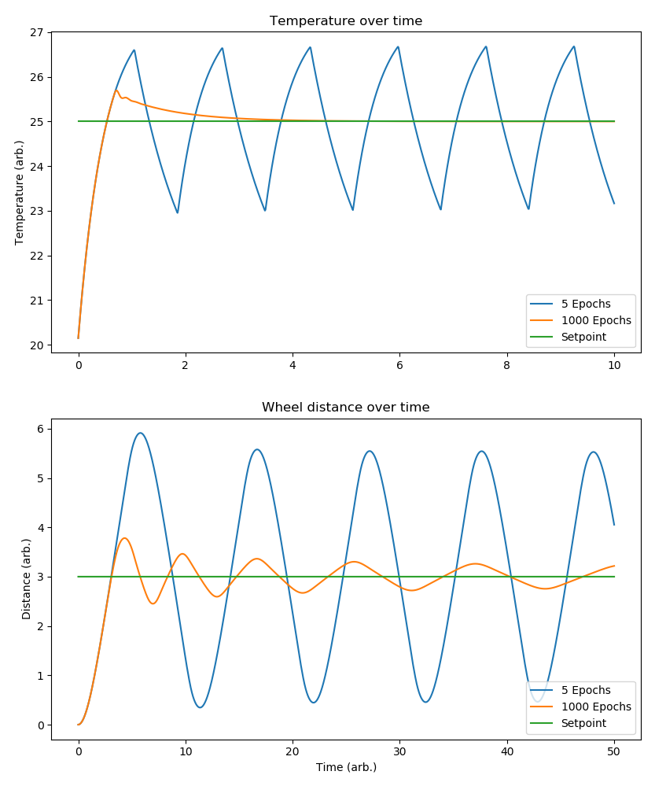

# PID Auto-tuning
This library offers a way to tune your PID feedback loops automatically using gradient descent. There are 2 example simulations given (a thermostat which must make the room attain a certain temperature), and a robot wheel (which must travel a certain distance exactly, i.e. not go over or under that distance).

Below are the plots of these simulations once they have been tuned.
